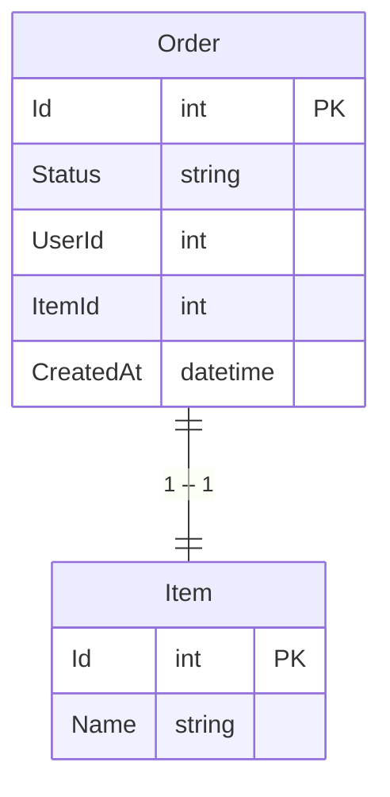

# Orders

## Introduction

This is a simple marketplace application where users can buy and sell items. Sellers can mark the order as completed after delivering the item. If orders that are not paid (not marked) within 2 hours of creation are automatically deleted from the system. Users can retrieve all of their orders.

## Setup

### Prerequisites

Make sure you have installed the following:

- dotnet 3.1 or later

### Building the application

```bash
dotnet build
```

### Running the application

```bash
dotnet run
```

### Database

The application uses a PostgreSQL database. Here is the database schema:

```sql
CREATE TABLE IF NOT EXISTS items
(
    id SERIAL PRIMARY KEY,
    name VARCHAR(100) NOT NULL
)

CREATE TABLE IF NOT EXISTS orders
(
    id SERIAL PRIMARY KEY,
    status VARCHAR(100) NOT NULL,
    user_id INT,
    item_id INT,
    created_at TIMESTAMP,
    FOREIGN KEY (item_id) REFERENCES items (id)
)
```

Users are handled by the external system and fetched from the following endpoint:
- https://jsonplaceholder.typicode.com/users/



## API Documentation

### Endpoints

#### Items

- `GET /items`: Retrieve all items
- `POST /items`: Create a new item

#### Orders

- `GET /orders`: Retrieve all orders (does not include orders that are not paid within 2 hours of creation)
- `POST /orders`: Create a new order
- `PUT /orders/{id}/complete`: Mark an order as completed

#### Users

- `GET /users/{id}/orders`: Retrieve all orders of a user